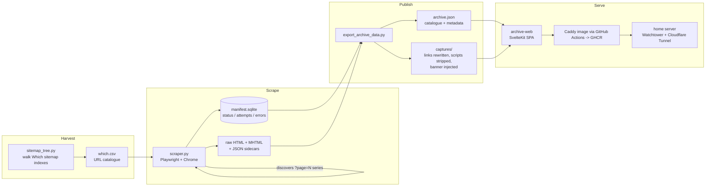

# Which? Archive

[](https://github.com/chrisJuresh/which/actions/workflows/deploy.yml)

A personal offline archive of [Which?](https://www.which.co.uk) pages: a resumable Playwright scraper, a link-rewriting publish pipeline, and a SvelteKit browser for the captured collection.

Which? is a subscription service, and articles change or disappear over time. This project keeps a private, browsable snapshot of the pages a subscriber cares about — captured with their own logged-in session, stored locally, and viewable through a fast catalogue UI where every internal link keeps working: links to archived pages open the local copy, links to anything else fall through to the live site.

The reference instance archives **8,543 pages** (review hubs, best-buy and buying guides, product hubs and more) with a 100% capture rate, and runs on a home server behind a Cloudflare Tunnel with CI-built images auto-deployed from this repo.

> **Note**: this is a personal-use archival tool — keep the archive private. Captured content is never committed to this repository (see `.gitignore`), and the scraper is deliberately polite: it paces itself, honours `Retry-After`, and stops on HTTP 429 rather than pushing through.

## How it works



Three stages, three tools:

1. **Scrape** (`scraper.py`) — works through the URL list in a SQLite manifest, driving a real Chrome profile via Playwright. Every page is captured twice: the fully rendered HTML and an MHTML snapshot (via CDP `Page.captureSnapshot`). Every capture is recorded with status, HTTP code, timestamps and file paths, so a run can be stopped and resumed at any point.
2. **Publish** (`export_archive_data.py`) — builds `archive.json` (title, description, image, category and page type for every URL, extracted with lxml) and copies captures into the web app's static tree after rewriting them. Anchors that point at an archived page are rewritten to the local copy; other Which? links become absolute live URLs; external links are left alone. `<script>` tags are stripped so the captured React pages stay frozen instead of re-running and 404-ing, and a slim banner is injected linking each capture back to its live original.
3. **Browse** (`archive-web/`) — a static SvelteKit SPA over `archive.json`: dashboard with archive stats, category grid and tree, relevance-ranked search across all pages, a best-and-buying-guides view, and a detail page per capture with prev/next navigation and related pages.

## Features

**Scraper**
- **Resumable by design** — SQLite manifest (WAL) tracks every URL; interrupted runs recover automatically, Ctrl+C leaves the current page pending.
- **Session-aware** — verifies the logged-in session before every page; detects login walls, CAPTCHAs and "sign in to unlock" prompts by checking what is actually *visible* on the page, then pauses with a desktop alert and lets you sign back in without losing the run. Only the *names* of the session cookies it verifies are recorded — never values or passwords (the login itself lives in the dedicated browser profile).
- **Failure triage** — distinguishes a broken URL from a broken session (redirect-loop probing), a transient server error (bounded exponential backoff) from rate limiting (parses `Retry-After`, stops the run safely).
- **Polite pacing** — targets a seconds-per-page budget (default 5 s, load time included), or spreads the whole pending set over `--target-hours`; prints per-page timing, run average and ETA.
- **Pagination discovery** — finds `?page=N` listing series from the links a first page actually renders, enumerates the bounded range (capped), and never chains from paginated pages — so a windowed pager that always shows a "next" link cannot cause a runaway crawl. A `discover` subcommand backfills series from captures made before this feature existed.

**Publish pipeline**
- **Self-contained mirror** — tri-state link rewriting (local / live / untouched external) with fragments preserved.
- **Frozen captures** — script stripping keeps rendered React snapshots intact; originals on disk stay pristine (rewriting happens at publish time).
- **Fast re-exports** — metadata parse cache keyed by file signature, capture-map signature to skip unnecessary rewrite passes, hardlink publishing for unchanged files, atomic writes with retry against transient Windows file locks.

**Web app**
- Category tree derived from URL structure, with per-category archived/pending/failed counts.
- Search across titles, descriptions, categories, types and URLs, ranked by where the match occurred.
- Page types (Best guide, Buying guide, Review hub, How we test, …) and a featured-guides view.
- Incremental list rendering, deep-linkable search and category routes, graceful "no data yet" state.

## Quick start

Prerequisites: [uv](https://docs.astral.sh/uv/), Node 18+, and Google Chrome — the scraper drives your installed Chrome by default. `--channel msedge` uses Edge instead, and `--channel chromium` uses Playwright's bundled browser (install it once with `uv run playwright install chromium`).

**Windows, one click**: double-click `Start Which Archive.bat` — it creates the venv, installs Python and npm dependencies, exports the data if needed, and opens the site at `http://localhost:5173`. Use `Refresh Data and Start.bat` after a new scrape.

**Any platform, by hand:**

```bash
uv venv
uv pip install -r requirements.txt

# 1. Sign in once (opens a dedicated Chrome profile; verify a subscriber page)
uv run python scraper.py login

# 2. Scrape (resumable; re-run any time)
uv run python scraper.py scrape

# 3. Export the catalogue + rewritten captures, then serve the UI
cd archive-web
npm install
npm run dev        # runs the export first, then vite dev
```

`which.csv` (the URL catalogue) ships in the repo; regenerate or extend it from Which?'s own sitemaps with `uv run python sitemap_tree.py`.

## Scraper commands

```
uv run python scraper.py <command> [--csv which.csv] [--out scraped]
```

| Command | What it does |
|---|---|
| `login` | Opens the dedicated browser profile, waits for you to sign in, records which session cookies matter and verifies them. |
| `scrape` | Works through pending URLs. Key flags: `--target-seconds` (default 5), `--target-hours`, `--delay`/`--jitter`, `--limit`, `--retries`, `--retry-failed`, `--block-media`, `--no-pagination`, `--max-mhtml-mb`. |
| `status` | Manifest totals by status, plus the next pending URL and its last error. |
| `discover` | Offline backfill: scans downloaded listing captures for `?page=N` series and queues them. |
| `reset --failed` / `reset --url <url>` | Requeue failed pages, or one specific page. |
| `clear-session` | Wipes the dedicated browser session (cookies, storage, login marker) — captures and progress are untouched. |

Captures land in `scraped/`: `raw-html/` and `mhtml/` (sharded by slug prefix), `meta/` JSON sidecars, and `manifest.sqlite`. Removing a URL from the CSV never deletes its captures — the manifest import is strictly additive.

If Chrome ever shows `ERR_TOO_MANY_REDIRECTS`, the dedicated scraper session is broken: run `clear-session`, then `login`, then `scrape` — captures and progress are untouched.

## Export options

```
uv run python export_archive_data.py [--no-rewrite] [--no-banner] [--keep-scripts] [--force-rewrite]
```

By default captures are link-rewritten, script-stripped and banner-injected into `archive-web/static/captures/`, and the catalogue is written to `archive-web/static/data/archive.json`. The flags publish verbatim copies, skip the banner, keep scripts, or force a full rewrite pass.

## Project structure

```
scraper.py                  Resumable Playwright scraper (login, scrape, status, discover, reset)
export_archive_data.py      Catalogue export + link-rewrite/publish pipeline
sitemap_tree.py             Walks Which? sitemap indexes into a tree + flat URL CSV
sitemap.py                  Earlier flat sitemap-to-CSV script
which.csv                   URL catalogue driving the scrape (8,543 URLs)
which_active_urls_only.csv  Full sitemap harvest (~19,600 URLs)
archive-web/                SvelteKit SPA (static adapter, client-side rendering)
  src/lib/archive.ts        Loads archive.json, builds category tree/search index
  src/routes/               Dashboard, /browse, /search, /guides, /page/[id]
deploy/                     Dockerfile (Node build -> Caddy), compose.yaml, Caddyfile
scripts/run-site.ps1        One-command local bootstrap (used by the .bat launchers)
scripts/sync-data.ps1       Pushes captures + archive.json to the server over ssh/scp
.github/workflows/deploy.yml  Builds and publishes the site image to GHCR on push
```

## Deployment

The reference instance runs privately at **which.chrisj.uk** (SSO-gated with Cloudflare Access) on a home server:

- **Image**: multi-stage Docker build — `node:20-alpine` builds the SPA, `caddy:2-alpine` serves it with SPA fallback, compression, immutable caching for hashed assets and hardened headers.
- **Data stays out of the image**: `archive.json` and the captures are bind-mounted read-only, so publishing new content is a data sync (`scripts/sync-data.ps1`), not a rebuild.
- **CI/CD**: every push to `main` that touches the web app or deploy files builds and pushes `ghcr.io/chrisjuresh/which:latest` using only the built-in `GITHUB_TOKEN`; Watchtower on the server pulls it within ~2 minutes.
- **Networking**: exposed exclusively through a Cloudflare Tunnel — no inbound ports on the home network, TLS at Cloudflare's edge, Cloudflare Access SSO in front. The tunnel and Watchtower are the shared [infra](https://github.com/chrisJuresh/infra) stack.

See [`deploy/README.md`](deploy/README.md) for the compose stack and first-time setup.

<!-- screenshot: homepage dashboard showing 8,543 archived pages, category grid and stat tiles -->
<!-- screenshot: an archived Which? page with the teal "Which Archive" banner and local links -->

## Tech stack

- **Scraper/pipeline**: Python 3, Playwright (Chromium/CDP), lxml, SQLite, uv
- **Web**: SvelteKit 2 (Svelte 5), TypeScript, Vite, static adapter (pure client-side SPA), Lucide icons
- **Ops**: Docker (multi-stage), Caddy, Docker Compose, GitHub Actions, GHCR, Watchtower, Cloudflare Tunnel
- **Windows tooling**: PowerShell bootstrap/sync scripts, double-click `.bat` launchers

## Status and limitations

Personal project, built and deployed in July 2026; the archive it serves is complete (100% of the catalogue captured) and the stack is in maintenance mode.

- The scraper requires an active Which? subscription and an interactive first login; it deliberately has no headless/credential-based auth.
- Captures freeze the page as rendered — interactive widgets inside articles will not function (scripts are stripped by design; MHTML snapshots are kept for full fidelity).
- The catalogue CSV, category rules and page-type heuristics are Which?-specific; pointing the system at another site would need adaptation.
- Archived content is for personal use. Respect Which?'s terms of use — this repo contains the tooling only, never the content.
